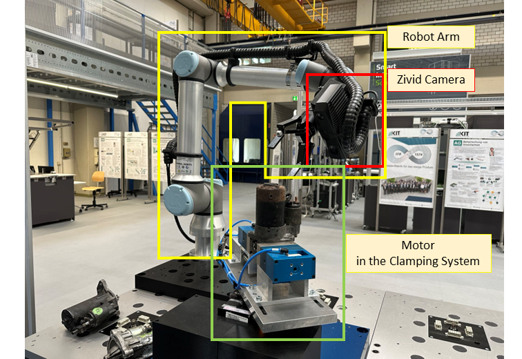
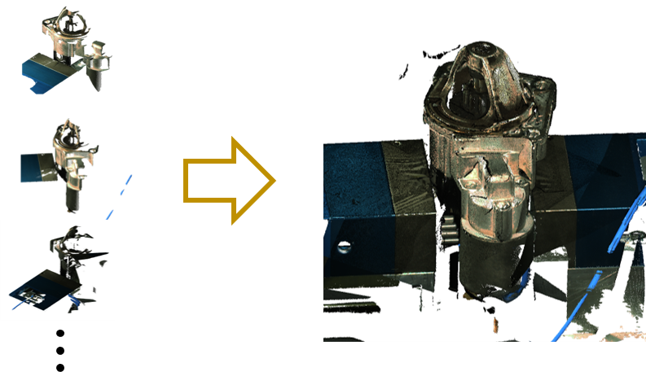

# SFB_zivid
As shown in the figure the camera is mounted an the robot arm. Both the camera and the robot arm are controlled in a system based on ROS.

In this directory there is an demo to scan a motor in several directions and combine the single-view point clouds into a full model point cloud.

