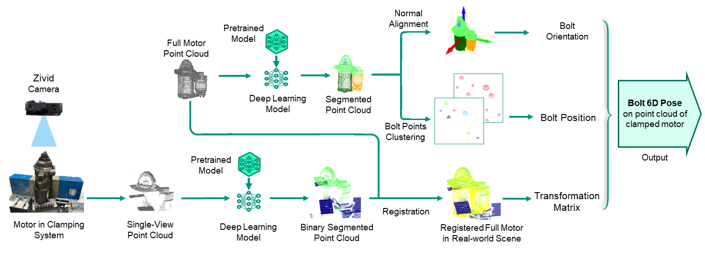

# Full pipeline of 6D Pose Estimation

We employ three distinct coordinate systems in our study. 
The first is the robot coordinate system, referred to as Coordinate System $\mathcal{A}$, 
which has its origin at the center of the robot arm's base and serves as the final reference for all the results in the actual remanufacturing pipeline. 
The second is the Zivid camera coordinate system, denoted as Coordinate System $\mathcal{B}$, 
which is used for the scanned single-view point clouds. 
Finally, the third coordinate system is the coordinate system of the extra input of full motor point clouds, denoted as Coordinate System $\mathcal{C}$. 
The objective of this multi-stage pipeline is to estimate the 6D pose of motor bolts in the robot's coordinate system, 
orientation and position, 
with the additional help of certain extra input data and prior knowledge of the starter motor. 

As illustrated in figure, our full pipeline consists of five stages: (i) binary segmentation on real-world scene point cloud; (ii) part segmentation on the extra input of full motor point cloud; (iii) registration between two point clouds; (iv) bolt point clustering for bolt position; and (v) normal alignment for bolt orientation.
The following is examples of input:

and final result:

